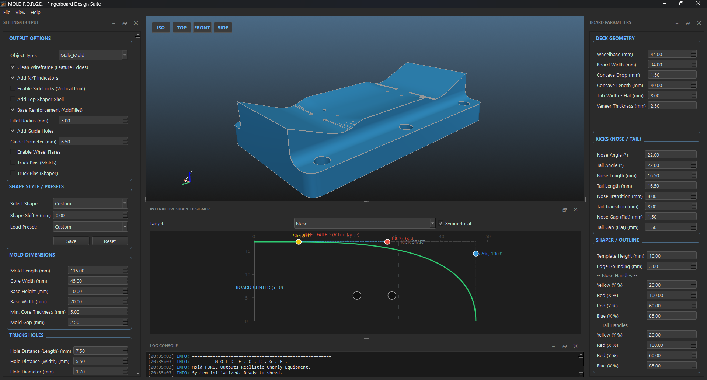

# 1. Welcome to *MOLD F.O.R.G.E.*

**MOLD F.O.R.G.E.** Outputs Realistic Gnarly Equipment and is a professional, standalone parametric CAD suite engineered specifically for high-fidelity fingerboard design and mold generation.

Moving beyond static 3D models and legacy CAD dependencies, this engine gives you complete mathematical control over every single aspect of your fingerboard deck. Whether you are pressing your first wooden deck or running a high-end boutique fingerboard brand, MOLD F.O.R.G.E. bridges the gap between digital design and physical manufacturing.

## 🚀 Core Features

* **⚡ Standalone & Multi-Threaded Engine:** Powered by CadQuery (OpenCASCADE) and PySide6, MOLD F.O.R.G.E. is now a 100% native application. Heavy 3D calculations run in a dedicated background thread, ensuring your interface and 2D/3D viewports never freeze during complex lofting operations.
* **📐 Dynamic Asymmetry:** Break free from standard shapes. Achieve independent nose and tail sculpting using our interactive Bezier curve editor, or import your own custom `.dxf` outlines for immediate 3D generation.
* **🏭 Press-Ready Manufacturing:** Built to withstand the bench vise. The engine automatically calculates crucial physical tolerances, including mold gaps, base reinforcements, vertical print side-locks, dynamic alignment pins with custom X/Y offsets, and optional embossed marking pins.
* **🧊 Vertical Print Optimization:** Enable the **Cut Base (Flush Sides)** feature to force the mold's base width to perfectly match the core width. It intelligently strips away side fillets and guide holes to guarantee a flawless, flat contact surface for printing molds vertically along the Z-axis.
* **🔄 Real-Time Sync & Performance Control:** Experience live 2D/3D visualization. Need to make massive parameter changes at once? Toggle off the 'Live Preview' and use the manual 'GENERATE 3D' button for a fluid, lag-free UI workflow.
* **🧠 Zero-Configuration:** No bloated or opinionated factory presets. The app starts clean, allowing you to build your own personal deck database from scratch, automatically managed via a local JSON file.
* **🌐 Community Shapes Store:** An integrated browser that directly connects to the GitHub repository, allowing you to discover, download, and install custom community-made `.dxf` outlines without ever leaving the application.
* **🥄 Spoon Kicks:** Advanced 3D concave logic. Add realistic, high-performance spoon-shaped dips to your Nose and Tail to create defined pockets for your fingers using robust solid intersections.
* **🔥 Extreme Mode:** An extreme override state that disables internal geometric safety limits. Push the sliders from -9999 to 9999 to experiment with highly non-standard, wild mold designs.

## 📖 Documentation & Guides

This Wiki is your official manual. We strongly recommend reading these pages in order to fully master the engine:

1. **[User Interface & Workflow](2-User-Interface-&-Workflow-Guide.md):** Learn how to navigate the 3D viewport, adjust settings, and batch-export your high-precision STEP files. *Read this before tuning the engine.*
2. **[The Parametric Engine](3-The-Parametric-Engine.md):** A comprehensive breakdown of every slider, toggle, and setting available in the design panels.
3. **[Custom Shapes (DXF Guide)](4-Custom-Shapes-DXF.md):** Step-by-step rules for preparing, exporting, and importing your own vector outlines (like Fishtails or Old School cruisers).
4. **[3D Printing & Manufacturing Guide](5-3D-Printing-Manufacturing.md):** Essential engineering advice on material selection, structural slicer settings, print orientation, and the wood pressing process.
5. **[Glossary of Terms](6-Glossary.md):** A quick reference guide covering skateboard anatomy, mold manufacturing concepts, and CAD terminology.

## 🤝 Open Source & License

Developed with passion and engineering rigor for the fingerboard community.

* **Code Engine License:** [AGPLv3](https://www.gnu.org/licenses/agpl-3.0.en.html) - Free to study, modify, and distribute. Network usage requires source disclosure.
* **3D Output & Designs:** CC BY-NC-SA 4.0 - Molds and decks generated using the default base parameters are for personal/non-commercial use.

Curious about what powers the engine? Check out the **About MOLD F.O.R.G.E.** window in the Help menu for a breakdown of the open-source technologies used.

If this tool helps you craft the perfect deck, consider checking out the **"Support the Project"** link in the app's menu!
