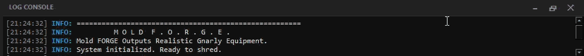

# 2. User Interface & Workflow Guide

MOLD F.O.R.G.E. features a professional, industrial-grade interface built on PySide6, designed specifically for high-precision CAD work and streamlined manufacturing.
This guide explains how to master the real-time 3D viewport, use the interactive 2D shape designer, and leverage the full command set to optimize your workflow.

---

## 🖥️ The 3D Viewport (PyVista)

The central area of the application is your real-time 3D workspace, powered by a high-performance VTK rendering engine.

* **Navigation Controls:**
  * **Rotate:** Left-click and drag.
  * **Zoom:** Use the mouse wheel or Right-click and drag.
  * **Pan:** Middle-click (scroll wheel click) and drag.
* **Camera Overlays:** In the top-left corner, quick-snap buttons (**ISO, TOP, FRONT, SIDE**) allow you to instantly align the view to standard engineering perspectives.

---

## 🎨 Interactive Shape Designer (2D Editor)

The bottom panel features the `KickShapeEditor`, a specialized visual node tool for "sculpting" your board's outline using interactive Bezier handles.

### Understanding the Control Handles

When **Shape Style** is set to **Custom**, three color-coded handles appear on the canvas:

* **🟡 Yellow Handle (Straight Section):** Controls the `StraightP` percentage. It defines how long the rails stay parallel before the tapering curve begins.
* **🔴 Red Handle (Primary Curve):** Adjusts the "shoulder" of the board (Ctrl1X/Y). It dictates the fullness and width of the transition.
* **🔵 Blue Handle (Tip Shape):** Controls the tip (Ctrl2X). Drag this to seamlessly switch between a pointy "Popsicle" and a squared-off "Box" shape.

### Advanced Fillet & Analysis Visualization

The editor performs a live geometric analysis, visually demonstrating how the **Edge Rounding** (`FilletYellow`) affects the physical cut:

* **The Green Line:** Represents the final, smooth physical edge of the board after the CNC/routing process.
* **The Orange "Wedge":** Visualizes the exact material being removed by the corner rounding process.
* **The Crosshair (+):** Marks the **True Origin**—the mathematical center point of the rounding arc.

### Technical Overlays

* **KICK START (Dashed Gray):** Indicates the exact axis where the board begins to bend upwards into the nose or tail.
* **Truck Holes (Gray Circles):** Displays the hardware mounting pattern to ensure your custom shape doesn't interfere with the trucks.
* **Wheel Flares (Purple Outlines):** Projects the 3D flare zones onto the 2D plane, helping you perfectly align your outline with the wheel clearance bumps.

---

## 📟 Log Console & Progress Bar

The bottom panel houses the diagnostic brain of MOLD F.O.R.G.E., providing real-time feedback on the multithreaded geometry engine.

* **Asynchronous Progress Bar:** 3D generation is a mathematically heavy process. The orange progress bar indicates that the CadQuery kernel is currently calculating complex lofts in the background, leaving your UI completely responsive and lag-free.
* **Diagnostic Info:** The console reports the **Max Dimensions** (Length, Width, Height) of the generated solid. This is your final sanity check to ensure the mold will fit your 3D printer's bed.
* **Validation Warnings:** If you enter a physically impossible parameter (e.g., a board wider than the mold core), the software will auto-correct the value, flash the specific UI widget in **Orange**, and log a warning.
* **Standard Output Redirection:** For advanced debugging, all raw `stdout` and `stderr` data from the underlying Python environment is intercepted and printed directly to this console.

---

## ⌨️ Commands & Shortcuts

MOLD F.O.R.G.E. utilizes a combination of hotkeys and menu commands to optimize the design-to-manufacturing pipeline.

* **F11 (Zen Mode):** Instantly toggles the visibility of all peripheral dock panels (Left, Right, Bottom). This maximizes the 3D workspace for detailed surface inspection or high-resolution screenshots.
* **Batch Export (File Menu):** The ultimate production command. It generates the Male Mold, Female Mold, and Shaper Template in a single sequence, saving them into a timestamped project folder alongside a technical `_Config.txt` report.
* **Export Current Object (File Menu):** Exports only the specific 3D model currently visible in the viewport as an STL or STEP file.
* **Load Config File (File Menu):** Imports parameters from a previously exported text report, instantly restoring every slider and toggle to a specific production state.
* **Enable Clipping Plane (View Menu):** Triggers a dynamic cross-section cut through the 3D model.
* **Unit Toggle (View Menu):** Instantly converts all console log measurements between **Metric (mm)** and **Imperial (in)**. *(Note: UI input sliders always remain in mm for engineering precision).*
* **Show Scale Grid (View Menu):** Displays a persistent 3D bounding box with axis labels and absolute measurements around the model.

---

## 💾 Presets & Data Management

Automate your workflow and never lose a perfect shape.

* **Save/Delete Preset:** Commit the current UI configuration to the local `fb_presets.json` database, or permanently remove it. Zero-configuration required.
* **Interactive Symmetry Lock:** A toggle in the 2D designer that mirrors Bezier changes symmetrically between the Nose and Tail. Uncheck this to unlock independent "Directional" design capabilities.
* **Target Swap:** In the 2D Designer, use the **Target Dropdown** to quickly switch focus between editing the Nose and Tail planes.

---
**[⬅️ Previous: Introduction](1-Introduction.md)** | **[🏠 Home](1-Introduction.md)** | **[Next: The Parametric Engine ➡️](3-The-Parametric-Engine.md)**
