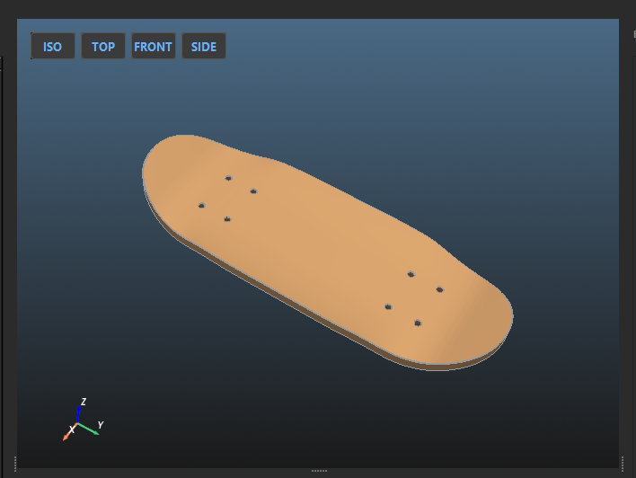

# 2. User Interface & Workflow Guide

MOLD F.O.R.G.E. features a professional, industrial-grade interface built on PySide6, designed specifically for high-precision CAD work and streamlined manufacturing.
This guide explains how to master the real-time 3D viewport, use the interactive 2D shape designer, and leverage the full command set to optimize your workflow.

---

## 🖥️ The 3D Viewport (PyVista)

The central area of the application is your real-time 3D workspace, powered by a high-performance VTK rendering engine.

* **Navigation Controls:**
  * **Rotate:** Left-click and drag.
  * **Zoom:** Use the mouse wheel or Right-click and drag.
  * **Pan:** Middle-click (scroll wheel click) and drag.
* **Camera Overlays (Top-Left):** Quick-snap buttons (**ISO, TOP, FRONT, SIDE**) allow you to instantly align the view to standard engineering perspectives.
* **Performance Controls (Top-Right):** Features the **Live Preview** toggle. By default, the engine recalculates the 3D model automatically when you adjust a slider. If you need to make massive parameter changes at once, uncheck this box. The interface will become completely lag-free, and a manual **GENERATE 3D** button will appear for you to click when you are ready to render.

---

## 🎨 Interactive Shape Designer (2D Editor)

The bottom panel features the `KickShapeEditor`, a specialized visual node tool for "sculpting" your board's outline using interactive Bezier handles.

### Understanding the Control Handles

When **Shape Style** is set to **Custom**, three color-coded handles appear on the canvas:

* **Yellow (Straight %):** Controls how far the rails stay perfectly straight before beginning to taper towards the kicks.
* **Red (Shoulder Curve):** The primary Bezier point. Adjusts the "fullness" or "sharpness" of the transition from the straight rail into the nose/tail tip.
* **Blue (Tip Boxiness):** The secondary Bezier point. Moving this horizontally determines whether the very tip of the board is pointed, fully rounded, or squared/boxy.

*(Note: If you load a DXF shape from the library, these handles are disabled, but the overall outline is still rendered here for visual scaling and alignment).*

---

## 🛠️ The Top Menu Commands

* **Export Current Object (File Menu):** Exports only the specific 3D model currently visible in the viewport as an STL or STEP file.
* **Batch Export Full Project (File Menu):** Automates the generation of a dedicated project folder and exports the Deck Preview, Male Mold, Female Mold, and Shaper Template all at once (configurable for STL, STEP, or both).
* **Load Config File (File Menu):** Imports parameters from a previously exported text report, instantly restoring every slider and toggle to a specific production state.
* **Enable Clipping Plane (View Menu):** Triggers a dynamic cross-section cut through the 3D model, essential for verifying core thickness and internal mold gaps.
* **Unit Toggle (View Menu):** Instantly converts all console log measurements between **Metric (mm)** and **Imperial (in)**. *(Note: UI input sliders always remain in mm for engineering precision).*
* **Show Scale Grid (View Menu):** Displays a persistent 3D bounding box with axis labels and absolute measurements around the model.

---

## 💾 Presets & Data Management

Automate your workflow and never lose a perfect shape.

* **Save/Delete Preset:** Commit the current UI configuration to your personal database, or permanently remove it.
  * *Zero-Configuration Philosophy:* MOLD F.O.R.G.E. does not ship with opinionated pre-loaded presets. The app starts clean. Your local `fb_presets.json` database file is automatically generated the very first time you hit "Save Preset".
* **Interactive Symmetry Lock:** A toggle in the 2D designer that mirrors Bezier changes symmetrically between the Nose and Tail. Uncheck this to unlock independent "Directional" design capabilities (e.g., steep short nose, long mellow tail).
* **Target Swap:** In the 2D Designer, use the **Target Dropdown** to quickly switch focus between editing the Nose and Tail planes.

---
**[⬅️ Previous: Introduction](1-Introduction.md)** | **[🏠 Home](1-Introduction.md)** | **[Next: The Parametric Engine ➡️](3-The-Parametric-Engine.md)**
