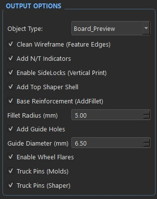

# 3. The Parametric Engine

Welcome to the control room. This page provides a comprehensive, technical breakdown of every parameter and toggle available in the MOLD F.O.R.G.E. left and right control panels.

Understanding these variables is the key to unlocking the full potential of the procedural geometry engine.

---

## ⚙️ OUTPUT OPTIONS (Left Dock)

These settings determine what the engine actually builds and toggle specific structural features for the manufacturing process.

* **Object Type:** Selects which part of the project to generate and render in the 3D viewport.
  * `Board_Preview`: A realistic 3D representation of the final deck to check the shape and concaves.
  * `Female_Mold`: The bottom block of the press.
  * `Male_Mold`: The top block of the press.
  * `Shaper_Template`: The 2D-outline guide used to route/cut the board after pressing.
* **Clean Wireframe (Feature Edges):** Toggles the 3D viewport rendering style. When checked, it hides the dense triangular mesh and displays only the sharp feature edges for a cleaner, professional CAD look.
* **Add N/T Indicators:** Embosses 'N' (Nose) and 'T' (Tail) markers directly onto the molds and shaper to prevent accidental misalignment during the wood pressing phase.
* **Enable SideLocks (Vertical Print):** Generates interlocking side tabs on the mold halves.
* **Add Top Shaper Shell:** Generates an additional mating top shell next to the Shaper Template. This allows you to "sandwich" the wood veneers during the routing phase, heavily preventing splintering.
* **Truck Pins (Molds):** Replaces standard through-holes with 0.5mm tapered embossed marking pins on the Male and Female molds. These press tiny pilot dimples directly into the wood veneer to ensure perfect alignment before drilling.
* **Truck Pins (Shaper):** Replaces through-holes with the same 0.5mm tapered marking pins on the Shaper Template to ensure your cutting guide is perfectly centered.
* **Cut Base (Flush Sides):** A manufacturing toggle optimized for vertical 3D printing. It forces the mold's Base Width to perfectly match the Core Width, creating flat, flush sides. *Activating this automatically disables Guide Holes and Base Fillets to guarantee a flat contact surface for the printer's build plate.*
* **Base Reinforcement (AddFillet):** Adds a curved structural fillet where the mold core meets the base plate to prevent stress fractures under heavy clamping loads.
* **Fillet Radius (mm):** The radius of the base reinforcement curve. Appears only when the reinforcement toggle is active.
* **Add Guide Holes:** Generates vertical holes through the mold shoulders for inserting metal alignment pins (e.g., M6 threaded rods).
* **Guide Diameter (mm):** The precise diameter of the alignment pin holes. Appears only when guide holes are enabled.
* **Hole Count:** Number of alignment holes. Must be an even number ranging from 4 to 20. Appears only when guide holes are enabled.
* **Offset X (mm):** Distance of the guide holes from the edge of the pressing core. Adjust this to ensure pins don't collide with the mold cavity.
* **Offset Y (mm):** Distance of the guide holes from the absolute top and bottom ends of the mold block.

---

## 🎨 SHAPE STYLE / PRESETS

* **Select Shape:** Defines the source of the board's outline.
  * `Custom`: Activates the internal interactive Bezier mathematical generator.
  * `[Filename]`: Loads a specific DXF vector outline from the external `shapes_library` folder.
* **Shape Shift Y (mm):** Shifts the DXF shape along the length axis. This is vital for asymmetrical boards (like Fishtails) where the visual center does not align with the truck holes.
* **Load Preset:** A dropdown to instantly load a saved deck and mold setup from your personal JSON database. *(Note: MOLD F.O.R.G.E. uses a zero-configuration approach and starts with a clean slate; no factory presets are included, ensuring your shapes remain uniquely yours).*
* **Save / Delete / Reset Preset:** Buttons to manage your local database. "Save" commits the current configuration. If a custom preset is loaded, the second button allows you to "Delete" it permanently. If you are on the default 'Custom' state, the button transforms into "Reset", reverting all sliders to factory defaults.

---

## 📦 MOLD DIMENSIONS

These settings control the overall physical size and structural thickness of the 3D printed mold blocks.

* **Mold Length (mm):** The total physical length of the mold block. It must be longer than your deck to ensure the Nose and Tail are fully supported.
* **Core Width (mm):** The width of the elevated central pressing core. It must be wider than your deck to ensure even pressure.
* **Base Height (mm):** The thickness of the solid structural foundation plate that absorbs the clamping force.
* **Base Width (mm):** The total width of the mold block, including the side shoulders. *Note: If the "Cut Base (Flush Sides)" toggle is active, this slider is hidden and the value is locked to match the Core Width.*
* **Min. Core Thickness (mm):** The thickness of the core at its lowest/thinnest point.
* **Mold Gap (mm):** The physical gap between the male and female molds. While it should generally match your Veneer Thickness, you can set this value slightly lower (e.g., -0.1mm or -0.2mm) to force a tighter compression and squeeze out all excess glue during pressing.

---

## 🔩 TRUCKS HOLES

Precision parameters for the hardware mounting pattern.

* **Custom Dimensions (Toggle):** Unlock to manually modify the standard truck hole spacing and diameter. Keep this unchecked to use the industry standard and prevent accidental geometry breaks.
* **Hole Distance (Length) (mm):** The longitudinal distance between the two holes in a single truck mount (industry standard is ~7.5mm).
* **Hole Distance (Width) (mm):** The lateral distance between the two holes (industry standard is ~5.5mm).
* **Hole Diameter (mm):** The diameter of the truck mounting holes. Default is 1.7mm for a tight fit with standard fingerboard screws.

---

## 🛹 DECK GEOMETRY

These parameters define the fundamental curvature of your fingerboard deck.

* **Wheelbase (mm):** Distance between the inner truck holes.
* **Board Width (mm):** The maximum target width of the deck. Imported DXF outlines scale automatically to match this dimension.
* **Concave Drop (mm):** The vertical depth of the concave curve in the center of the board.
* **Concave Length (mm):** The length of the central section where the concave stays at maximum depth before smoothly flattening out towards the kicks.
* **Tub Width - Flat (mm):** The width of the totally flat central section. Set to 0 for a continuous "U-shape", or increase for a flat pocket with steeper rails.
* **Veneer Thickness (mm):** The total nominal thickness of the finished deck, representing the calculated sum of all individual wood plies. This is a primary driver for the CAD engine: it defines the internal offset for the Top Shaper and determines the exact height of the Tapered Truck Pins.
* **Enable Spoon Kicks:** Adds realistic 3D concave curvature directly to the Nose and Tail (the "Spoon" effect). MOLD F.O.R.G.E. uses a proprietary 3-Zone mathematical logic (cosine interpolation) to seamlessly blend the central radial concave into the kicks, ensuring flawless G2 geometric continuity.
* **Spoon Depth (mm):** The maximum depth of the concave applied to the kicks. Visible only when Spoon Kicks are enabled.
* **Enable Wheel Flares:** Toggles the generation of 3D wheel flares on the deck surface. Activating this makes the "WHEEL FLARES" parameter group visible in the right panel.

---

## 🛞 WHEEL FLARES

Visible only if **Enable Wheel Flares** is checked in the Deck Geometry panel.

* **Flare Height (mm):** Maximum Z-height of the wheel flare bumps.
* **Flare Length (mm):** Total span of the flare along the board edge.
* **Flare Inward Width (mm):** Distance the flare extends inwards from the edge towards the center.
* **Offset Y (from truck mm):** Y-axis placement offset of the flare relative to the truck center. Positive moves it towards the tips, negative towards the center of the wheelbase.

---

## 📐 KICKS (NOSE / TAIL)

These sliders fine-tune the leverage and steepness of the board's ends. **Note:** Parameters are automatically mirrored between Nose and Tail if the `Symmetrical` toggle is active in the Interactive Designer.

* **Angle (°):** The strict steepness angle of the kick.
* **Length (mm):** The physical length of the kick section.
* **Transition (mm):** The length of the smooth radial bend transitioning from the flat wheelbase into the angled kick.
* **Gap (Flat) (mm):** The flat distance between the outer truck holes and the exact start of the kick transition. Smaller gaps create a snappier, more aggressive pop.

---

## 📏 SHAPER / OUTLINE (Right Dock)

Settings for the 2D cutting guide and the internal Custom Bezier engine.

* **Template Height (mm):** The vertical thickness of the 3D-printed routing template.
* **Edge Rounding (mm):** The radius of the shape's corner fillets (only applies when using the Custom Bezier shape).

### Bezier Handles (Nose & Tail)

These percentage-based parameters dynamically map to the colored handles in the interactive 2D designer, allowing you to fine-tune the shape using math if you prefer not to use the mouse.

* **Yellow (Y %):** Controls the `StraightP` percentage. Determines how long the rails stay parallel before tapering.
* **Red (X % / Y %):** Position of the primary control point (controls the fullness of the "shoulder").
* **Blue (X %):** Position of the secondary control point (controls tip "pointiness" vs. "boxiness").

---

## 🧠 Core Architecture Insights

### Geometric Abstractions & Measurement Standards

Mold F.O.R.G.E. is designed to maintain absolute mathematical purity in its backend (`cq_model.py`).

**The Wheelbase Paradigm (Inner vs. Outer):**
The CadQuery engine constructs the board strictly using the **Inner Wheelbase** (the distance between the inner truck mounting holes). However, many fingerboard makers design using the **Outer Wheelbase** standard.

To bridge this gap without risking recursive parameter loops or geometric paradoxes, the UI employs a "frontend abstraction." By toggling `Show Outer Wheelbase Eq.` in the Tools menu, the interface dynamically calculates the outer distance (`Inner Wheelbase + (Truck Hole Distance * 2)`) in real-time. This ensures makers get the visual feedback they need while the core CAD engine receives the pure, mathematically stable data it requires.

### Side Locks Architecture

The interlocking Side Locks have been heavily refactored for improved geometric stability. The boolean operations that carve the male and female alignment tabs now utilize optimized clearance calculations, ensuring that the exported STEP files slice flawlessly and the physical 3D printed molds fit together with exact tolerances, preventing lateral shifting during the pressing phase.

---
**[⬅️ Previous: UI & Workflow](2-User-Interface-&-Workflow-Guide.md)** | **[🏠 Home](1-Introduction.md)** | **[Next: Custom Shapes (DXF) ➡️](4-Custom-Shapes-DXF.md)**
