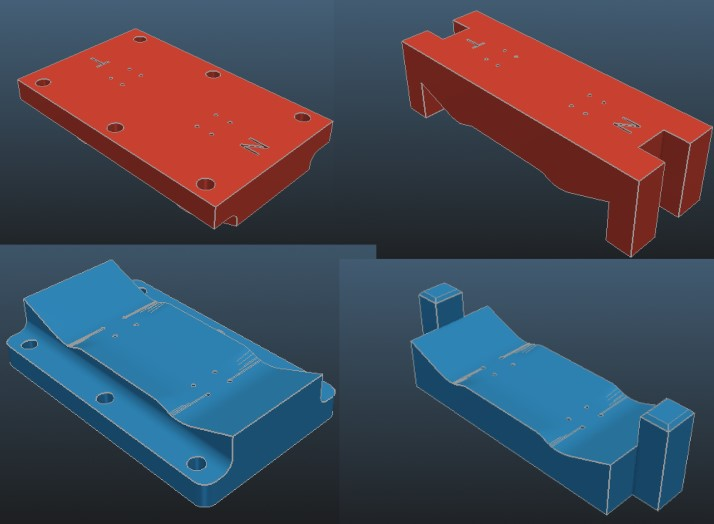

# 5. 3D Printing & Manufacturing Guide

Creating a high-quality fingerboard mold requires more than just a mathematically perfect 3D model. Since the mold blocks will be subjected to extreme clamping forces, your print settings and material choice are critical for both the quality of your decks and your personal safety.

---

## 🧵 Material Selection

* **PLA / PLA+:** The most common choice due to its high rigidity, which is excellent for maintaining the deck's intended shape. We highly recommend **PLA+** for its superior impact resistance and lower brittleness.
* **PETG:** Offers a great balance between rigidity and toughness. It is less likely to snap than PLA but may exhibit slight flex under extreme vise pressure.
* **Engineering Resin:** If using an SLA printer, you **must** use "Tough" or "ABS-like" resins. Standard decorative resins are far too brittle and may shatter dangerously under load.

---

## 🛠️ Slicer Settings (Engineering for Strength)

Do not use "decorative" or "standard" print profiles. Your mold needs internal structural integrity to withstand hundreds of kilograms of force.

* **Perimeters (Walls):** Use **4 to 6 walls**. In 3D printing, most of the structural strength comes from the outer shells.
* **Infill:** Set between **40% and 60%**.
  * *Pro Tip:* Use **Gyroid** or **Cubic** patterns. These are isotropic patterns that provide equal strength in all directions, unlike "Grid" or "Lines" which can collapse under one-dimensional pressure.
* **Top/Bottom Layers:** Use at least **5 layers** to prevent the vise from crushing or "pillowing" the mold's surface.

---

## 📐 Print Orientation & Surface Quality

MOLD F.O.R.G.E. allows you to optimize your print strategy based on your priorities:

1. **Standard Flat Printing:** Prints faster and is easier to set up, but may result in "stair-stepping" on the nose and tail curves.
2. **Vertical/Side Printing:** This is the professional choice. By printing the mold on its side, the layers run perpendicular to the pressing force, and the nose/tail curves become perfectly smooth.
   * *MOLD F.O.R.G.E. Feature:* Use the **SideLocks** toggle to ensure the mold halves stay perfectly registered during vertical pressing.

---

## 🔨 The Pressing Process

### 🗜️ Using a Bench Vise

For professional results, a bench vise is required.

* **SideLocks:** Always enable **SideLocks** in the Output Options. These interlocking tabs are vital to prevent the mold halves from sliding laterally as the vise applies pressure.
* **Alignment Pins:** Use the **Add Guide Holes** feature to insert metal rods (like M6 bolts) for perfect axial alignment.

### 🛹 Assembly Tips

* **Veneer Alignment:** If `AddMoldTruckPins` is enabled, use the embossed pins to "lock" the veneer stack in place. This ensures your truck holes remain centered even if the wood shifts slightly during the press.
* **Release Agent:** Apply a thin layer of wax or a specific release agent to the mold surface. This prevents escaped wood glue from permanently bonding your new deck to the 3D-printed plastic.
* **Curing Time:** Keep the deck under pressure for at least **24 hours** to allow the glue to set fully and minimize "springback" (the wood losing its curve).

---

## 🪚 Post-Processing

* **Sanding:** Even with vertical printing, a light sanding with 400-800 grit sandpaper on the mold surface will improve the final deck's surface quality.
* **STL Resolution:** Note that MOLD F.O.R.G.E. exports STLs with a high-precision tolerance (0.01/0.1) to eliminate the "orange peel" effect common in lower-quality CAD exports.

---
**[⬅️ Previous: Custom Shapes (DXF)](4-Custom-Shapes-DXF.md)** | **[🏠 Home](1-Introduction.md)** | **[Next: Glossary ➡️](6-Glossary.md)**
